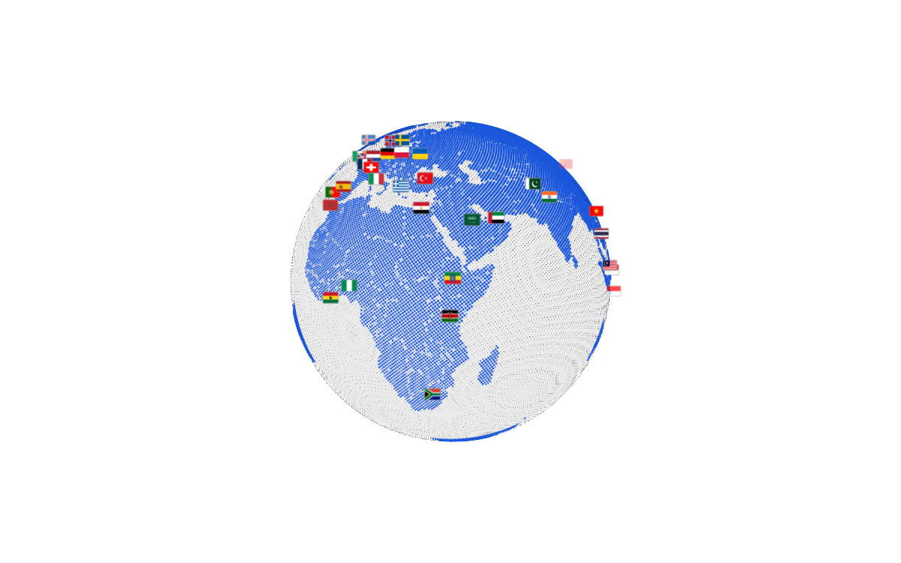

# Geora

A framework-agnostic 3D halftone globe for the web: tens of thousands of
shader-lit points forming a planet you can rotate, zoom and inspect, with a
beacon pinned to every nation.

```html
<geora-globe theme="paper" mode="country" auto-rotate></geora-globe>
```



No React, no Tailwind, no build step. Styles are isolated in the shadow DOM; the
only runtime dependencies are `three`, `d3-geo` and `topojson-client`.

## Install

```bash
npm install geora-globe
```

npm, pnpm and yarn all work. Ships ESM, CJS and type declarations.
Tarball ≈ 460 kB; the ESM bundle is ≈ 272 kB (≈ 76 kB gzipped).

## Quick start

```html
<!DOCTYPE html>
<html>
  <head>
    <script type="module" src="https://cdn.jsdelivr.net/npm/geora-globe@0.2.0/+esm"></script>
  </head>
  <body style="margin: 0; height: 100vh">
    <geora-globe theme="dark" mode="country" auto-rotate minimal></geora-globe>
  </body>
</html>
```

Importing the package registers `<geora-globe>`; the element fills its parent, so
give it — or an ancestor — a size. `minimal` renders the globe alone: no controls,
no navigation, no tooltip or card. Drop it, or pick pieces with `show-*`.

From a bundler:

```js
import 'geora-globe'

const globe = document.querySelector('geora-globe')
globe.addEventListener('geora-select', ({ detail }) => {
  console.log(detail.marker.country ?? detail.marker.marker)
})
```

In React, Vue or Svelte the element is a normal DOM node — bind a ref and add
listeners in the usual lifecycle hooks. No framework-specific package exists.

## How it works

Importing registers the element, which mounts a Three.js renderer in its shadow
root. A `theme` recolours the globe (sphere, dots, borders, beacons) — never the
page background — and a `mode` swaps the layer on screen. Configuration comes in
through attributes, properties and `data`; interactions go out as bubbling
`geora-*` `CustomEvent`s with plain JSON payloads.

## Attributes

Every attribute has a camelCase property (`flag-base` → `flagBase`). Booleans are
value-aware: present means true, `"false"`, `"0"` and `"off` mean false.

| Attribute | Default | What it does |
| --- | --- | --- |
| `theme` | `paper` | Globe palette; page background never changes |
| `mode` / `modes` | `country` / auto | Active layer / comma-separated subset |
| `auto-rotate` | `true` | Spin the globe |
| `motion` | `auto` | `auto` follows `prefers-reduced-motion` |
| `minimal` | `false` | Hide the built-in HUD → only the globe |
| `show-hud` | `true` | Master switch for the HUD |
| `show-tooltip` `show-info-card` `show-controls` `show-navigation` `show-settings` | `true` … `false` | Trim the HUD piece by piece |
| `show-markers` / `show-borders` | `true` | Beacons, flags, values / outlines |
| `flag-base` | `""` | Flags as `${flag-base}/${iso2}.png`; empty = code chips |
| `globe-scale` / `marker-scale` | `0.7` / `0.75` | Size multipliers |
| `detail` / `animation` | `2` / `1` | Dot density / animation intensity |
| `halftone-density` `halftone-scale` `contrast` `threshold` `intensity` `ambient` `ocean-opacity` | — | Shader calibration |
| `persistence` | `false` | Store prefs in `localStorage` |

## Properties and methods

```js
globe.theme = 'dark'                      // key or custom colour object
globe.halftone = { density: 0.8 }         // partial merge
globe.data = { countries, centers, markers, landmarks }   // partial ok
globe.setData({ markers: [{ id: 'hq', name: 'HQ', lat: 14.6, lon: 121 }] })

globe.selectCountry('PHL')   // true when found
globe.clearSelection()
globe.selection              // selected public marker, or null
globe.settings               // read-only snapshot of effective settings

globe.flyTo(48.85, 2.35)
globe.rotate(36, 0)
globe.zoom(-0.5)
globe.reset()

globe.start(); globe.stop(); globe.destroy()
```

## Events

All bubble and cross shadow boundaries, so listen on the element or any ancestor.

| Event | Detail |
| --- | --- |
| `geora-ready` | `{}` |
| `geora-hover` | `{ marker, x, y }` (`marker: null` when it leaves) |
| `geora-select` | `{ marker, x, y }` |
| `geora-country-select` / `geora-marker-select` | `{ country \| marker, x, y }` |
| `geora-sphere-select` | `{ lat, lon, onLand, country, distanceKm, x, y }` |
| `geora-clear` | `{}` — also fired on mode change |
| `geora-mode-change` | `{ mode, modes }` |
| `geora-theme-change` | `{ theme, key }` — `background` is advisory |
| `geora-reset` | `{}` |

Markers are plain data: `{ kind: 'country', country }`, `{ kind: 'center', center, country }`,
`{ kind: 'analytics', country, row }`, `{ kind: 'polaroid', landmark }`, `{ kind: 'marker', marker }`.

## Data

Everything comes through `data` / `setData()`. Defaults ship with the package
(50 countries, 73 AI campuses, 50 landmarks) and are entirely optional.

| Collection | Fields |
| --- | --- |
| `countries` | `code` (ISO alpha-3), `iso2`, `country`, `name`, `lat`, `lon`, `region`, `pop`, `tz`, `curr`, `fact` |
| `centers` | `id`, `name`, `operator`, `code`, `lat`, `lon`, `status`, `powerGW`, `tier`, `focus` |
| `markers` | `id`, `name`, `lat`, `lon`, `type` |
| `landmarks` | `iso2`, `country`, `caption`, `lat`, `lon`, `image` |

`code`, `lat` and `lon` are required on a country. `joinLandmarks(places, base)`
builds landmark entries with `image = base/${iso2}.jpg`. No images ship with the
package: point `flag-base` / `image` at your own files, and a missing file falls
back to an ISO code chip instead of breaking.

## Themes and modes

| Theme | Label | | Mode | Shows |
| --- | --- | --- | --- | --- |
| `paper` | PAPER WHITE | | `country` | beacon + flag per nation |
| `dark` | INK BLACK | | `polaroid` | one photograph per landmark |
| `amber` | AMBER SCREEN | | `analytics` | modeled telemetry (labelled) |
| `matrix` | PHOSPHOR GREEN | | `centers` | announced AI campuses |
| `blueprint` | BLUEPRINT GRID | | `markers` | host markers (needs data) |
| `dusk` | DUSK VIOLET | | | |

A theme recolours the globe only — the stage stays on its default paper white.
Custom themes are plain objects (`{ background, globe, foreground, accent, border }`)
with missing colours falling back; apply `background` yourself through
`--geora-stage-bg` if you want full-page theming.

## Performance, accessibility, styling

- `detail` is the main lever (`0`–`2`); `animation: 0` keeps it static but
  interactive; `motion="off"` freezes spin, pulses and inertia.
- The renderer pauses on disconnect and releases everything on `destroy()`.
- Focusable, `role="application"`, polite live region, and full keyboard control:
  arrows rotate, `+`/`-` zoom, `Home` resets, `1`–`9` jump to a layer, `Escape`
  clears.
- Custom properties: `--geora-stage-bg`, `--geora-accent`, `--geora-panel`,
  `--geora-panel-border`, `--geora-text`, `--geora-text-dim`, `--geora-font`,
  `--geora-shadow`, `--geora-radius`.

## Headless

```js
import { GeoraGlobe, registerGeoraGlobe } from 'geora-globe'

new GeoraGlobe({ container: document.getElementById('stage'), theme: 'dark' })
registerGeoraGlobe('my-globe')   // <my-globe></my-globe>
```

`GeoraGlobe` exposes the same properties, methods and events with no attributes
and no built-in HUD.

## Development

```bash
npm install
npm run dev          # demo at http://localhost:5173
npm run build:demo && npm run preview   # static demo on :4173
npm test             # vitest
npm run lint
npm run build        # library → dist/
```

The demo in `demo/` imports `geora-globe` exactly like an external consumer and
never reaches into `src/`.

**Deploy the demo (Vercel):** `vercel.json` pins `npm run build:demo` →
`demo-dist`. Import the repo in Vercel and deploy, or run `npx vercel --prod`.
Any static host works — publish `demo-dist/`.

**Publish the package:**

```bash
npm login
npm publish --dry-run
npm version patch     # or minor / major
npm publish           # prepack builds dist/ automatically
```

`files` limits the tarball to `dist/`, `README.md` and `LICENSE`.

## Contact

- GitHub: [github.com/leigabriel/geora](https://github.com/leigabriel/geora)
- Instagram: [instagram.com/leimxnsquare](https://instagram.com/leimxnsquare)
- Email: [malibiranleigabriel@gmail.com](mailto:malibiranleigabriel@gmail.com)

## Credits

Natural Earth via [world-atlas](https://github.com/topojson/world-atlas), flags via
[flagcdn](https://flagcdn.com), landmark photographs from Wikipedia (CC BY-SA or
public domain, credited in `public/landmarks/credits.json`), type in Geist Pixel
(Vercel) and JetBrains Mono (SIL OFL), audio synthesized with Tone.js in the demo.

## License

MIT © Lei Gabriel