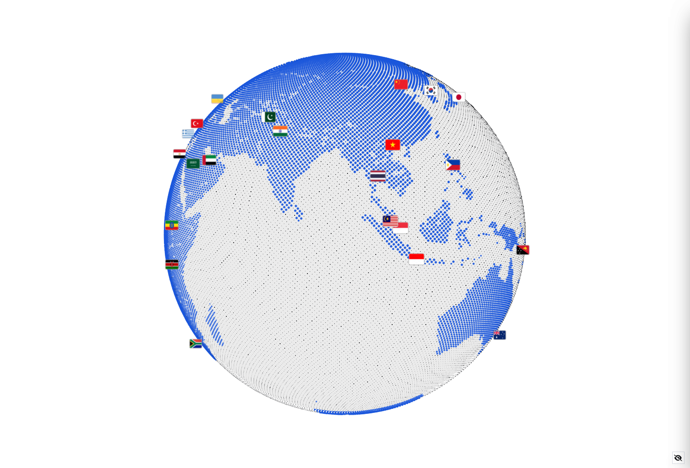

# geora-globe

A framework-agnostic 3D halftone globe for the web. The planet is drawn as tens
of thousands of shader-lit points: land carries the Natural Earth 110m raster,
borders glow in the accent colour, and every nation is pinned with a beacon you
can rotate to, zoom into and inspect.

Ship it as a custom element:

```html
<geora-globe theme="paper" mode="country" auto-rotate></geora-globe>
```

or drive the engine directly from JavaScript. No React, no Tailwind, no build
tooling required — styles are isolated in the component's shadow DOM and the
only runtime dependencies are `three`, `d3-geo` and `topojson-client`.



## What is Geora

Geora is a spatial visualization interface built around one interactive
halftone globe — rotate it, zoom it, tap the beacons pinned to every nation.
It started as a standalone app; the engine behind it is now published
independently as the `geora-globe` package so any web project can embed the
same planet. This repository holds both:

- `src/` — the package: the `GeoraGlobe` engine, the `<geora-globe>` custom
  element, default data, themes and type declarations.
- `demo/` — the Geora application itself, consuming the package exactly like an
  external user would.

## How it works

1. Importing `geora-globe` registers `<geora-globe>`. The element fills its
   parent and mounts a Three.js renderer inside its shadow root — page styles
   and component styles cannot leak either way.
2. The planet is a GPU point cloud: land, borders and beacons are dots shaded
   by a halftone shader. A `theme` recolours the stage (backdrop, sphere, dots,
   beacons); a `mode` swaps which layer is on screen (countries, polaroids,
   analytics, AI centers, host markers).
3. Configuration flows in through attributes, properties and the `data`
   property; interactions flow out as bubbling `geora-*` `CustomEvent`s with
   plain-data payloads. That is the whole contract — any framework, or plain
   HTML, can drive it.

## Install

```bash
npm install geora-globe
```

Works with npm, pnpm and yarn. The package ships ESM (`dist/index.js`), CJS
(`dist/index.cjs`) and type declarations (`dist/index.d.ts`).

Size: the published tarball is ~460 kB (10 files). The ESM bundle is ~272 kB
(~76 kB gzipped) and carries no UI framework — styles live in the shadow DOM and
the only runtime dependencies are `three`, `d3-geo` and `topojson-client`.

## Quick start

### HTML

```html
<!DOCTYPE html>
<html>
  <head>
    <script
      type="module"
      src="https://cdn.jsdelivr.net/npm/geora-globe@0.1.0/+esm"
    ></script>
  </head>
  <body style="margin: 0; height: 100vh">
    <geora-globe theme="dark" mode="country" auto-rotate></geora-globe>
  </body>
</html>
```

Importing the package registers `<geora-globe>` once. The element fills its
parent, so give it — or an ancestor — a size.

### JavaScript (any bundler)

```js
import 'geora-globe'

const globe = document.querySelector('geora-globe')

globe.addEventListener('geora-select', (event) => {
  console.log(event.detail.marker)
})
```

### React

There is no React-specific package: the element is a normal DOM node.

```jsx
import { useEffect, useRef } from 'react'
import 'geora-globe'

export function Globe() {
  const ref = useRef(null)

  useEffect(() => {
    const el = ref.current
    const onSelect = (event) => console.log(event.detail.marker)
    el.addEventListener('geora-select', onSelect)
    return () => el.removeEventListener('geora-select', onSelect)
  }, [])

  return <geora-globe ref={ref} theme="matrix" mode="centers" auto-rotate />
}
```

### Vue

```vue
<script setup>
import { onBeforeUnmount, onMounted, ref } from 'vue'
import 'geora-globe'

const globe = ref(null)
const onSelect = (event) => console.log(event.detail.marker)

onMounted(() => globe.value.addEventListener('geora-select', onSelect))
onBeforeUnmount(() => globe.value.removeEventListener('geora-select', onSelect))
</script>

<template>
  <geora-globe ref="globe" theme="dusk" mode="polaroid" auto-rotate />
</template>
```

### Svelte

```svelte
<script>
  import 'geora-globe'
  import { onDestroy, onMount } from 'svelte'

  let globe
  const onSelect = (event) => console.log(event.detail.marker)

  onMount(() => globe.addEventListener('geora-select', onSelect))
  onDestroy(() => globe?.removeEventListener('geora-select', onSelect))
</script>

<geora-globe bind:this={globe} theme="blueprint" mode="analytics" />
```

## Tutorial: your first globe

A complete page in five steps — no build step required:

```html
<!DOCTYPE html>
<html>
  <head>
    <script type="module" src="https://cdn.jsdelivr.net/npm/geora-globe@0.1.0/+esm"></script>
    <style>geora-globe { display: block; width: 100vw; height: 100vh }</style>
  </head>
  <body>
    <geora-globe theme="dark" mode="country" auto-rotate></geora-globe>
    <script type="module">
      const globe = document.querySelector('geora-globe')

      // 1. react to a beacon tap
      globe.addEventListener('geora-select', ({ detail }) => {
        console.log(detail.marker.kind, detail.marker.country ?? detail.marker.marker)
      })

      // 2. bring your own beacons
      globe.setData({
        markers: [
          { id: 'hq', name: 'HQ', lat: 14.6, lon: 120.98 },
          { id: 'lab', name: 'Lab', lat: 35.68, lon: 139.69 },
        ],
      })

      // 3. drive everything from script
      globe.theme = 'matrix'
      globe.mode = 'markers'
      globe.flyTo(14.6, 120.98)
    </script>
  </body>
</html>
```

Serve the file over HTTP (any static server — `npx serve .` works) and the
globe appears with the shipped 50-country dataset. From there: set `flag-base`
to your flag folder for sprites, `data.countries` for your own nations, and a
[custom theme object](#themes) for your palette.

## Attributes

Every attribute has a same-named camelCase property (`flag-base` →
`flagBase`). Attributes are the declarative surface; properties are the live
one — writing a property after mount takes effect immediately. Booleans are
value-aware: present means true, `"false"`, `"0"` and `"off"` mean false.

| Attribute | Default | Description |
| --- | --- | --- |
| `theme` | `paper` | Built-in theme key (see [Themes](#themes)) |
| `mode` | `country` | Active layer: `country`, `polaroid`, `analytics`, `centers` or `markers` |
| `modes` | auto | Comma-separated subset to expose; auto = all layers that have data (`markers` only when marker data exists) |
| `auto-rotate` | `true` | Spin the globe; alias of the `spinning` property |
| `motion` | `auto` | `auto` follows `prefers-reduced-motion`, `on` forces motion, `off` freezes spin, pulses and inertia |
| `flag-base` | `""` | Base path for flag sprites: `${flag-base}/${iso2}.png` (plus `@2x`). Empty = no flag requests, code chips instead |
| `minimal` | `false` | Hide the component's entire HUD (tooltip, card, controls, navigation, settings) |
| `show-hud` | `true` | Master switch for the built-in HUD |
| `show-tooltip` | `true` | Hover tooltip |
| `show-info-card` | `true` | Selection card |
| `show-controls` | `true` | Reset / spin / zoom controls |
| `show-navigation` | `true` | Layer navigation |
| `show-settings` | `false` | Settings toggle and panel |
| `show-borders` | `true` | Country outlines |
| `show-markers` | `true` | Beacons, flags and values |
| `globe-scale` | `0.7` | Globe size multiplier (0.7 – 1.35 recommended) |
| `marker-scale` | `0.75` | Beacon visibility multiplier |
| `detail` | `2` | Dot density: `0` low, `1` medium, `2` high |
| `animation` | `1` | Animation intensity multiplier (0 – 2.5) |
| `halftone-density` | `1.0` | Dot cloud density |
| `halftone-scale` | `1.0` | Dot size |
| `contrast` | `1.0` | Terminator contrast |
| `threshold` | `0.4` | Dot edge threshold |
| `intensity` | `1.0` | Shader intensity |
| `ambient` | `0.2` | Ambient fill weight |
| `ocean-opacity` | `1.0` | Ocean dot weight |
| `persistence` | `false` | Persist preferences to `localStorage` (`geora-globe:prefs:v1`) |

```html
<geora-globe
  theme="amber"
  mode="analytics"
  detail="1"
  animation="0.5"
  flag-base="/flags"
  show-settings
></geora-globe>
```

## Properties and methods

```js
const globe = document.querySelector('geora-globe')

// configuration (same values as the attributes, plus objects)
globe.theme = 'dark'                       // key or custom colour object
globe.mode = 'centers'                     // switches layer, clears selection
globe.modes = ['country', 'centers']       // restrict the rotation
globe.spinning = false                     // = autoRotate
globe.motion = false                       // true | false | 'auto'
globe.detail = 1
globe.globeScale = 0.9
globe.animation = 0.5
globe.halftone = { density: 0.8, threshold: 0.45 }   // partial merge
globe.flagBase = '/flags'
globe.showBorders = false
globe.minimal = true

// data
globe.data = { countries, centers, markers, landmarks }  // partial ok
globe.setData({ markers: [{ name: 'Relay', lat: 51.5, lon: -0.1 }] })

// selection
globe.selectCountry('PHL')     // true when found; switches to country mode
globe.clearSelection()         // true when something was selected
globe.selection                // the selected public marker, or null

// camera
globe.flyTo(48.85, 2.35)
globe.rotate(36, 0)            // keyboard-accessible drag
globe.zoom(-0.5)               // keyboard-accessible wheel
globe.reset()                  // default camera, clears the selection

// lifecycle
globe.start()                  // render loop (runs on connect)
globe.stop()                   // pause the loop
globe.destroy()                // dispose the scene and every resource
globe.settings                 // read-only snapshot of effective settings
```

`setData()` accepts any subset: omitted collections keep their current (or
default) contents. Supplying `markers` adds the `markers` layer to `modes`;
removing all of them drops it again.

## Events

All events are `CustomEvent`s that bubble and cross shadow boundaries
(`composed: true`), so listening on the element or on any ancestor works.

| Event | Detail |
| --- | --- |
| `geora-ready` | `{}` — the render loop started |
| `geora-hover` | `{ marker, x, y }` — hovered marker changed (`marker: null` when left); `x`/`y` are viewport coordinates |
| `geora-select` | `{ marker, x, y }` — a marker was selected (`x`/`y` are `null` for programmatic selection) |
| `geora-country-select` | `{ country, x, y }` — a country beacon was selected |
| `geora-marker-select` | `{ marker, x, y }` — a host-supplied marker was selected |
| `geora-sphere-select` | `{ lat, lon, onLand, country, distanceKm, x, y }` — a tap on the bare sphere |
| `geora-clear` | `{}` — the selection was cleared (also fired when the mode changes) |
| `geora-mode-change` | `{ mode, modes }` — the active layer or the mode list changed |
| `geora-theme-change` | `{ theme, key }` — theme changed; `theme` is the public colour object, `key` is `null` for custom themes |
| `geora-reset` | `{}` — `reset()` ran |

```js
globe.addEventListener('geora-select', ({ detail }) => {
  const { marker, x, y } = detail
  if (marker.kind === 'country') showCountry(marker.country)
})
```

## Data

Everything the globe draws comes through `data` (constructor option, `data`
property, or `setData()`). The default dataset — 50 countries, 73 AI data
centers, 50 landmark entries — ships with the package and is entirely optional.

### Country

```js
{
  code: 'PHL',          // ISO 3166-1 alpha-3, required (join key)
  iso2: 'ph',           // used by flag sprites and landmark joins
  country: 'Philippines',
  name: 'Manila',       // capital
  lat: 14.6, lon: 120.98,
  region: 'Asia',
  pop: '109M', tz: 'UTC+8', curr: 'PHP',
  fact: '…'             // one-line card copy
}
```

### Center (AI data center)

```js
{
  id: 'x', name: '…', operator: '…',
  code: 'USA',          // host country, joins to a country for flight/card
  lat: 39.0, lon: -77.5,
  status: 'operating',  // label via defaultCenters' status list
  powerGW: 1.2,         // announced figure, never estimated
  tier: 'core', focus: 'training'
}
```

### Marker (host-supplied)

```js
{ id: 'm1', name: 'Relay 1', lat: 51.5, lon: -0.1, type: 'dish' }
```

### Landmark (polaroid layer)

```js
{
  iso2: 'jp',
  country: 'Japan',
  caption: 'Mount Fuji',
  lat: 35.36, lon: 138.72,
  image: 'landmarks/jp.jpg'   // any URL; omitted = no photo, label only
}
```

`joinLandmarks(places, imageBase)` (exported) joins the package's landmark
coordinate list to your countries and builds `image` URLs as
`${imageBase}/${iso2}.jpg`:

```js
import { joinLandmarks } from 'geora-globe'

globe.data = { landmarks: joinLandmarks(myCountries, '/photos') }
```

Flag sprites are the same pattern: `flagBase = '/flags'` requests
`/flags/ph.png` and `/flags/ph@2x.png`. With `flagBase` empty (the default)
nothing is requested and markers fall back to code chips, so the component is
offline-safe out of the box.

## Themes

Themes repaint the globe stage only — backdrop, sphere, dots, beacons. The
component's own HUD and your page chrome keep their own palette, so a dark
globe never drags the interface into unreadable contrast.

| Key | Label | Background | Foreground | Accent |
| --- | --- | --- | --- | --- |
| `paper` | PAPER WHITE | `#ffffff` | `#121316` | `#1a56db` |
| `dark` | INK BLACK | `#07080a` | `#ffffff` | `#00ffaa` |
| `amber` | AMBER SCREEN | `#0d0900` | `#ffb700` | `#ffe066` |
| `matrix` | PHOSPHOR GREEN | `#020a04` | `#00ff66` | `#88ffbb` |
| `blueprint` | BLUEPRINT GRID | `#061225` | `#cfe4ff` | `#4da3ff` |
| `dusk` | DUSK VIOLET | `#120a1e` | `#e8dcff` | `#b08cff` |

A custom theme is a plain object — `#rrggbb`, `#rgb` or `0xRRGGBB` values,
missing colours fall back so a partial theme stays legible:

```js
globe.theme = {
  label: 'SOLAR',
  background: '#1a0f00',
  globe: '#2b1a00',
  foreground: '#ffd27f',
  accent: '#ff9d00',
  border: '#ff9d00',
}
```

`THEMES`, `THEME_KEYS`, `nextTheme(key)` and `themeHex(0xRRGGBB)` are exported
for hosts that build their own theme pickers.

## Modes

| Key | Layer | Shows |
| --- | --- | --- |
| `country` | COUNTRIES | One beacon + flag per nation |
| `polaroid` | POLAROIDS | One photograph per landmark, pinned where it stands |
| `analytics` | ANALYTICS | Modeled traffic / sessions / uptime / latency per nation |
| `centers` | AI DATA CENTERS | Announced AI compute campuses |
| `markers` | MARKERS | Host-supplied markers — only when marker data exists |

Restrict the rotation with `modes="country, centers"` or
`globe.modes = ['country', 'markers']`. The analytics layer is synthetic
(deterministic per country code) and labelled as modeled everywhere it shows —
replace `data.countries` with your own rows, or hide the layer, to drive it
from real telemetry.

## Headless: the GeoraGlobe class

The custom element is a thin shell over `GeoraGlobe`. Use the class directly
when you own the DOM:

```js
import { GeoraGlobe } from 'geora-globe'

const globe = new GeoraGlobe({
  container: document.getElementById('stage'),
  theme: 'dark',
  mode: 'country',
  spinning: true,
  data: { countries, markers },
})

globe.start()
// …
globe.destroy()
```

It exposes the same properties, methods and events as the element (minus the
attribute plumbing and built-in HUD).

To register the element under your own tag:

```js
import { registerGeoraGlobe } from 'geora-globe'
registerGeoraGlobe('my-globe')   // <my-globe></my-globe>
```

## Performance

- `detail` is the main lever: `0` (low) draws the fewest points, `2` (high) the
  densest. Ship `0` or `1` on constrained devices.
- `animation` scales pulse/bob/idle motion; `0` keeps the camera and content
  static while remaining interactive.
- `globeScale` changes size, not distance — it pulls the camera in.
- `motion="off"` (or `prefers-reduced-motion`) freezes auto-rotation, pulses
  and drag inertia in one switch.
- The renderer pauses when the element leaves the DOM (`stop()` / disconnect)
  and releases every GPU resource on `destroy()`.

## Accessibility

- The element is focusable (`tabindex="0"`), labelled
  `role="application"` / "Geora interactive globe" (override with your own
  `aria-label`), and announces selections through a polite live region.
- Keyboard, when the element has focus:

  | Key | Action |
  | --- | --- |
  | `←` `→` `↑` `↓` | Rotate |
  | `+` / `-` | Zoom |
  | `Home` | Reset view |
  | `1`–`9` | Jump to mode |
  | `Escape` | Close settings, then clear selection |
  | `Tab` | Leave the globe for the next control |

- `motion="auto"` (default) follows the OS `prefers-reduced-motion` setting;
  `on` / `off` override it.
- Drag, wheel and tap all work with pointer and touch input; the canvas cursor
  reflects grab / grabbing / pointer states.

## Styling

Styles live in the shadow DOM: no global CSS is emitted, no Tailwind required,
and page styles cannot leak in. The component exposes custom properties on the
host for restyling:

```css
geora-globe {
  --geora-font: 'JetBrains Mono', monospace;
  --geora-accent: #ff5c00;
  --geora-radius: 4px;
  --geora-stage-bg: #101014; /* pre-theme backdrop */
}
```

Full list: `--geora-font`, `--geora-panel`, `--geora-panel-border`,
`--geora-text`, `--geora-text-dim`, `--geora-accent`, `--geora-shadow`,
`--geora-radius`, `--geora-stage-bg`. The same stylesheet is exported as
`geora-globe/styles.css` for reference.

## Development (this repository)

```bash
npm install
```

### Run the demo

```bash
npm run dev          # Vite dev server — open the printed localhost URL
```

or serve the built demo:

```bash
npm run build:demo   # static site → demo-dist/
npm run preview      # vite preview → http://localhost:4173
```

The demo in `demo/` imports `geora-globe` exactly like an external consumer —
no file in `demo/` reaches into `src/`. `npm run assets` re-downloads flags and
fonts into `public/`; `npm run landmarks` re-downloads the credited Wikipedia
photographs.

### Test, lint, build

```bash
npm test             # vitest (jsdom)
npm run lint         # eslint
npm run build        # library build → dist/
```

### Deploy the demo (Vercel)

The repository ships a `vercel.json` that pins the build command
(`npm run build:demo`) and the output directory (`demo-dist`), so the demo
deploys as a static site with no settings to configure:

- **Dashboard** — import `github.com/leigabriel/geora` in Vercel and press
  Deploy; the framework is auto-detected and `vercel.json` supplies the rest.
- **CLI** — `npx vercel` (preview) then `npx vercel --prod`.

The same output works on any static host: publish the `demo-dist/` folder.

### Publish the package

```bash
npm login
npm publish --dry-run     # inspect the tarball without publishing
npm version patch         # or minor / major — bumps package.json + tag
npm publish               # prepack runs npm run build first
```

The `files` whitelist in `package.json` keeps the tarball to `dist/`,
`README.md` and `LICENSE`.

## Contact

- GitHub: [github.com/leigabriel/geora](https://github.com/leigabriel/geora)
- Instagram: [instagram.com/leimxnsquare](https://instagram.com/leimxnsquare)
- Email: [malibiranleigabriel@gmail.com](mailto:malibiranleigabriel@gmail.com)

## Credits

Natural Earth data via [world-atlas](https://github.com/topojson/world-atlas)
(public domain). Landmark photographs from Wikipedia, each CC BY-SA or public
domain, credited by author and source in `public/landmarks/credits.json`. Flags
served by [flagcdn](https://flagcdn.com). Geist Pixel (Vercel) and JetBrains Mono
are licensed under the SIL Open Font License; three.js, d3-geo and
topojson-client are MIT licensed.

## License

MIT © Lei Gabriel
